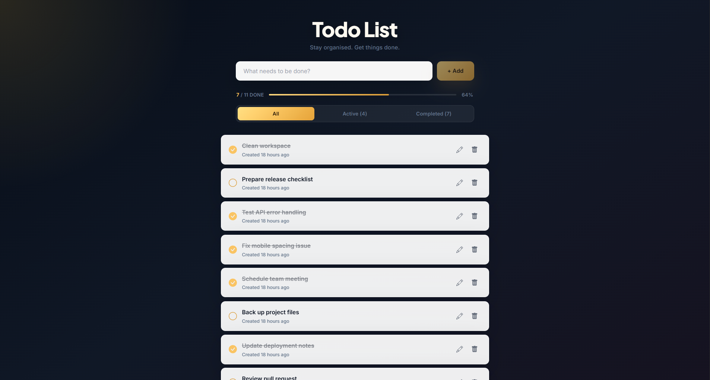
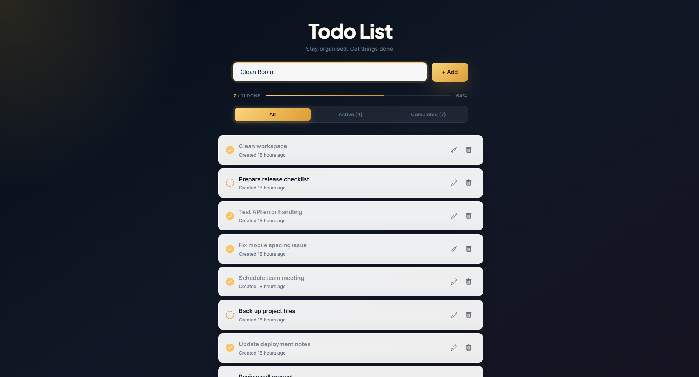
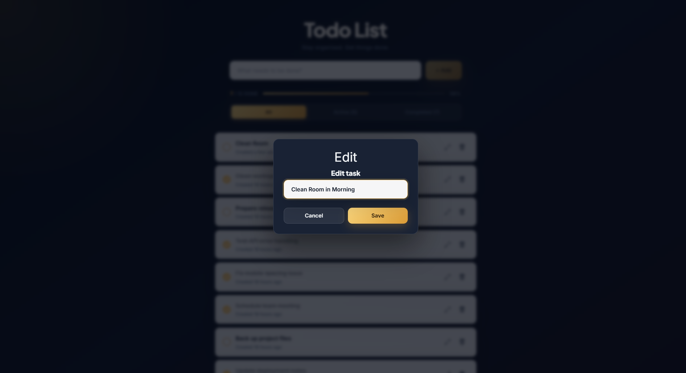
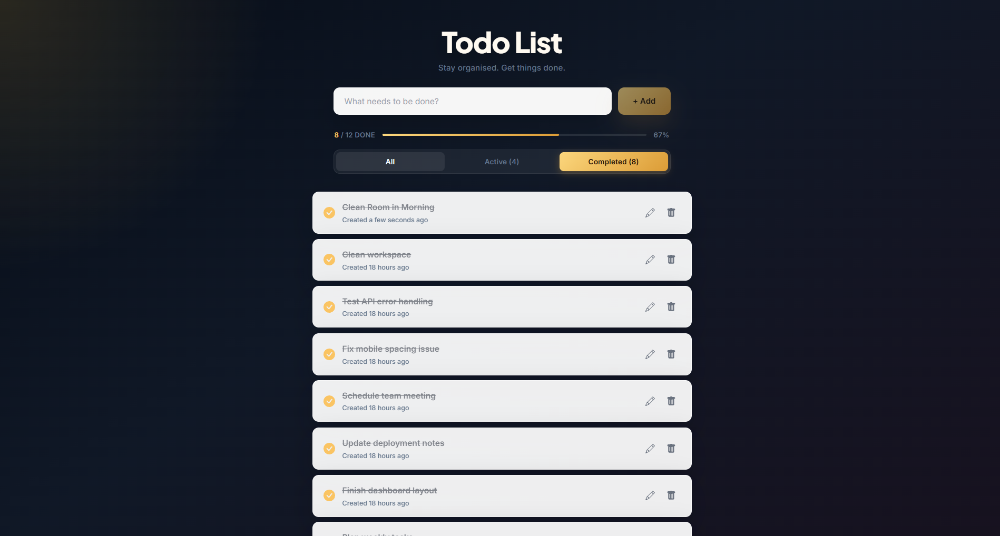
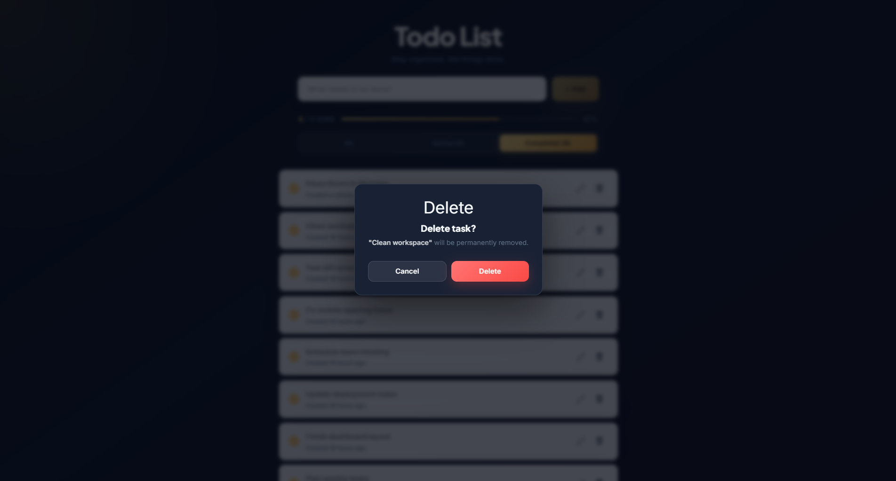

# Todo App

A full-stack todo application built with React, Express, MongoDB, and Node.js. Users can create tasks, update task text, mark tasks as complete, delete tasks, and see when each task was created.

## Live App

https://haider-todo-app.vercel.app

## Features

- Add new tasks.
- View saved tasks from MongoDB.
- Mark tasks as complete or pending by clicking the task status.
- Edit existing tasks inline.
- Delete tasks with confirmation.
- Show relative created time for each task.
- Run locally with Node.js or Docker Compose.
- Deploy on Vercel with MongoDB Atlas.

## Screenshots

### Home



### Create Task



### Edit Task



### Completed Tasks



### Delete Confirmation



## Tech Stack

| Part | Tech |
| --- | --- |
| Frontend | React, React Icons, Day.js |
| Backend | Node.js, Express |
| Database | MongoDB, Mongoose |
| Local containers | Docker, Docker Compose |
| Deployment | Vercel, MongoDB Atlas |

## Project Structure

```text
.
|-- api/                 # Vercel API entrypoint
|-- backend/             # Express server and todo model
|-- frontend/            # React app
|-- docker-compose.yml   # Local Docker setup
|-- vercel.json          # Vercel build and routing config
|-- .env.example         # Example environment variables
`-- README.md
```

## Environment Variables

Create a `.env` file in the project root.

```env
MONGO_URI=mongodb+srv://<username>:<password>@<cluster-url>/todo?retryWrites=true&w=majority
BACKEND_PORT=5000
FRONTEND_PORT=3000
CLIENT_ORIGIN=http://localhost:3000
```

For Docker with the local MongoDB service, use:

```env
MONGO_URI=mongodb://db:27017/todo
BACKEND_PORT=5000
FRONTEND_PORT=3000
CLIENT_ORIGIN=http://localhost:3000
```

## Run Locally

Install backend dependencies:

```bash
cd backend
npm install
```

Install frontend dependencies:

```bash
cd frontend
npm install
```

Start the backend:

```bash
cd backend
npm run dev
```

Start the frontend in another terminal:

```bash
cd frontend
npm start
```

Open:

```text
http://localhost:3000
```

## Run With Docker

Create `.env` from `.env.example`, then use the local MongoDB URI:

```env
MONGO_URI=mongodb://db:27017/todo
```

Start the app:

```bash
docker compose up --build
```

Open:

```text
http://localhost:3000
```

Stop the app:

```bash
docker compose down
```

## MongoDB Atlas

For the deployed app, use MongoDB Atlas.

1. Create an Atlas cluster.
2. Create a database user.
3. Add network access for Vercel.
4. Copy the Node.js connection string from **Connect > Drivers**.
5. Add the database name `todo` after `.net/`.

Example:

```text
mongodb+srv://<username>:<password>@<cluster-url>/todo?retryWrites=true&w=majority
```

Use this value as `MONGO_URI` in Vercel.

## Vercel Deployment

This project uses `vercel.json` to:

- build the React app from `frontend/`
- serve the build output from `frontend/build`
- route `/api/*` requests to `api/index.js`

Add this environment variable in Vercel:

```text
MONGO_URI
```

Deploy:

```bash
vercel --prod
```

## API Routes

| Method | Route | Description |
| --- | --- | --- |
| `GET` | `/api/health` | Check API status |
| `GET` | `/api/get` | Get all todos |
| `POST` | `/api/add` | Create a todo |
| `PUT` | `/api/edit/:id` | Update todo completion |
| `PUT` | `/api/update/:id` | Update todo text |
| `DELETE` | `/api/delete/:id` | Delete a todo |

Create todo body: `task` = `Finish deployment`

Update todo text body: `task` = `Update README`

Update completion body: `done` = `true`

## Scripts

Run all tests:

```bash
npm test
```

Build for Vercel:

```bash
npm run vercel-build
```

Backend development:

```bash
cd backend
npm run dev
```

Frontend development:

```bash
cd frontend
npm start
```
